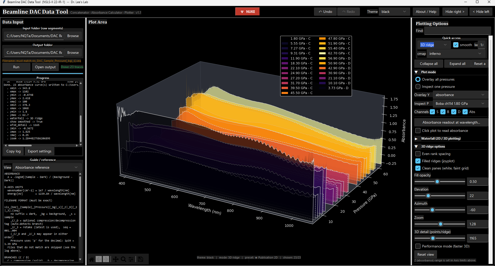

# Beamline DAC Data Tool (NSLS-II 22-IR-1)

A standalone Windows tool for the visible-light absorption workflow on
diamond-anvil-cell (DAC) samples at NSLS-II beamline 22-IR-1. It concatenates
the four raw grating segments of each measurement, computes absorbance, and
plots the results with publication-ready 2D and 3D options.



## What's new in v1.3

- **3D ridge:**
  - Log-Z (absorbance) scale.
  - Reference-guide planes: the 2D vertical/horizontal markers are drawn as
    translucent planes inside the 3D box (reusing the marker color/style/width/
    opacity controls; honors log-Z).
- **Plotting & styling:**
  - Trace colors locked to the full loaded dataset, so colors stay put when you
    toggle traces.
  - Legend / Colorbar / Reference-guides split into their own Style sections.
  - Optional user-typed legend title with its own font size.
  - Limits row: Auto checkbox + "Apply limits" + "Reset axes"; quick-access
    "Reset view" now resets both the 2D zoom/pan and the 3D camera.
- **Theme consistency:** caret / title / quick-access backgrounds follow the
  theme; true-black theme fixed; accent tint on by default.
- **Defringe:** FFT-notch n·t search window and acceptance p-value are now
  adjustable (defaults unchanged).
- **UI:** "Export D list (CSV) by selection"; tick / grid / marker control
  cleanup.
- **Packaging:** `pywin32` marked Windows-only in `requirements.txt`.

## What's new in v1.2

- **FFT-notch defringe** (contributed by [Matthew Diamond](https://github.com/matthewrdiamond)):
  - Enable toggle and a notch-width slider.
  - Defringed absorbance flows through every plot.
  - Per-pressure "Defringe report" QC log (detected n·t and p-value).
  - "Export defringed CSV".
  - Run also writes `*_absorbance_notch.csv` when defringe is enabled.
- **3D ridge enhancements:**
  - Box stretch X/Y/Z (rectangular box without respacing the data).
  - Appearance selector (Walls + traces / Walls only / Traces only).
  - Color traces by colormap.
  - Camera presets (Iso / Front / Side / Top).
  - Back-wall / floor projection.
  - Independent 3D line width.
  - Real-GPa tick labels on the pressure axis.

## What's new in v1.1

- Even rank spacing now OFF by default; 3D detail default lowered to 1000 for
  smoother rotation on laptops.
- Offset/step "Auto" button: evenly spaces ridges across the pressure axis in
  view (3D).
- Inspect-one-pressure now works while 3D ridge is selected (shows the 2D
  channel view instead of a meaningless single ridge).
- "No raw background" toggle (zeroes raw opacity, restores on untick).
- Grid and reference markers unified into one consistent styling layout
  (color / pattern / width / opacity); markers gained an opacity control.
- Per-item text sizes: title, axis labels, axis tick text, legend, and colorbar
  each have their own size box (the single global size control was removed).
- Colorbar customization: label text, orientation, label/tick size, thickness,
  tick count.
- "Legend opacity" renamed to "Legend bg opacity"; added a legend size control.
- Cambria headers on the three panes; bordered "Quick access" strip.
- Readout + click-to-read moved into Plot mode.
- Run progress bar.
- Performance: debounced redraws + a "Performance mode" toggle (off by default)
  that decimates 3D harder and skips the raw ghost. 2D and exports are
  unaffected.

## What it does

- Reads raw spectrometer segment files (`vis_{DAC}_{Sample}_{Pressure}[...].001..004`).
- Concatenates the four segments per measurement and computes
  `A = -log10[(Sample - Dark) / (Background - Dark)]`.
- Writes one absorbance CSV per pressure into an auto-named output subfolder.
- Interactive plotting: overlay, inspect-one-pressure, 2D stacked waterfall,
  and a filled 3D ridge (joyplot) view.
- Crameri perceptually-uniform colormaps, smoothing, journal styling,
  per-axis tick control, light/dark mode, and named presets.

## Run from source

```
pip install -r requirements.txt
python app.py
```

Or double-click `run.bat`.

## Build a standalone .exe (no Python needed on the target PC)

```
python -m venv build-env
build-env\Scripts\activate
pip install -r requirements.txt
pyinstaller beamline_tool.spec
```

The result is a self-contained folder at `dist\DAC_QuickLook\`. Ship the whole
folder; the program is `DAC_QuickLook.exe` inside it. A onedir build (rather
than a single packed .exe) is used deliberately: it starts faster and is far
less likely to be flagged by antivirus / SmartScreen.

If Windows SmartScreen warns on first launch (expected for any unsigned exe):
More info -> Run anyway. To remove the warning entirely, sign the exe with a
code-signing certificate.

## Files

| File | Purpose |
|------|---------|
| `app.py` | GUI, plotting, all controls |
| `engine.py` | parse / concatenate / absorbance / CSV output |
| `defringe.py` | FFT-notch defringe (interference-fringe removal) |
| `smoothing.py` | 5-step smoothing pipeline |
| `colormaps.py` | Crameri + matplotlib colormaps |
| `decomp.py` | known decompression-pressure sets |
| `beamline_tool.spec`, `version_info.txt` | PyInstaller build config |
| `requirements.txt` | dependencies |

## Credits

- FFT-notch defringe (`defringe.py`) contributed by
  [Matthew Diamond](https://github.com/matthewrdiamond).

## License

Internal lab tool. All rights reserved by the authors.
